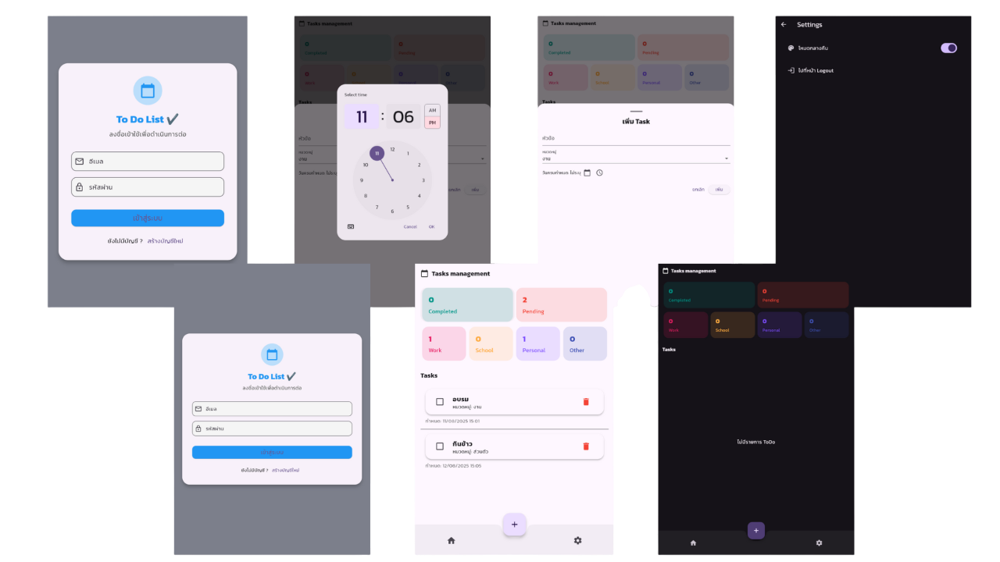

# flutter_todo_list

พัฒนาโดย

สมาชิก 
นายสิทธิชัย แสงนนท์ 6612732134 
นายพีรพัฒน์ สุทธปัญญา 6612732121 
นางสาววาสน มาฤทธ 6712732126 
นางสาววรัญญา ฉิมงาม 6712732125 

สาขาวิทยาการคอมพิวเตอร์

มหาวิทายาลัยราชภัฏศรีสะเกษ

## คำแนะนำการใช้งาน (User Guide)

ยินดีต้อนรับสู่แอป To Do List – แอปจัดการงานส่วนตัวที่ออกแบบมาให้ใช้งานง่าย ทันสมัย และรองรับภาษาไทยเต็มรูปแบบ 🇹🇭
เหมาะสำหรับผู้ที่ต้องการจัดระเบียบชีวิตประจำวันให้เป็นระบบมากขึ้น ✅

ฟีเจอร์หลัก
เพิ่ม/ลบ/แก้ไขงานในรายการได้อย่างสะดวก

จัดกลุ่มงานตามหมวดหมู่ โรงเรียน, งาน, ส่วนตัว, อื่นๆ
กำหนดวันเวลาเสร็จงาน และแสดงรายการแยกตามหมวดหมู่

รองรับ Dark Mode 

วิธีเริ่มต้นใช้งาน
เปิดแอป แล้วเข้าสู่หน้าจอสมัครสมาชิก และ login

กดปุ่ม ➕ เพื่อเพิ่มงานใหม่

ใส่ชื่อ, รายละเอียด, วันที่ต้องการทำให้เสร็จ

บันทึกงาน และจัดการรายการของคุณได้ทุกที่ทุกเวลา

คำแนะนำเพิ่มเติม
ใช้หมวดหมู่ช่วยในการจัดการงานให้มีประสิทธิภาพมากขึ้น

ลบงานที่เสร็จแล้วเพื่อให้รายการดูสะอาดตา

เปิดใช้งาน Dark Mode เพื่อถนอมสายตาในเวลากลางคืน

## คำแนะนำในการใช้งาน (Recommendations)

แอปนี้เหมาะสำหรับผู้ใช้งานทั่วไปที่ต้องการจัดการรายการสิ่งที่ต้องทำ (To Do List) อย่างเป็นระบบ 

ผู้ใช้ควรเพิ่มรายการสิ่งที่ต้องทำเป็นประจำทุกวัน เพื่อช่วยในการจัดลำดับความสำคัญและวางแผนงานได้ชัดเจนยิ่งขึ้น

สามารถใช้ฟีเจอร์ หมวดหมู่, วันที่กำหนด, และ สถานะการทำงาน เพื่อจัดระเบียบรายการให้มีประสิทธิภาพยิ่งขึ้น

ผู้ใช้งานสามารถเปิดใช้งานโหมด Dark Mode เพื่อความสบายตา โดยเฉพาะในเวลากลางคืน

## ตัวอย่างหน้าจอผู้ใช้งาน (User Interface)
